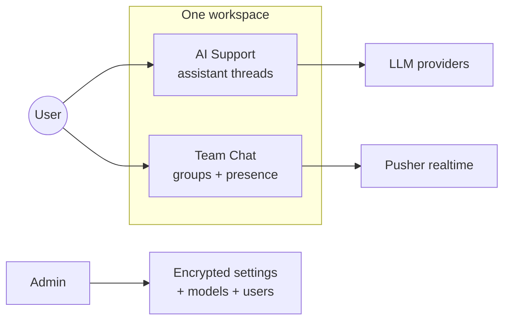
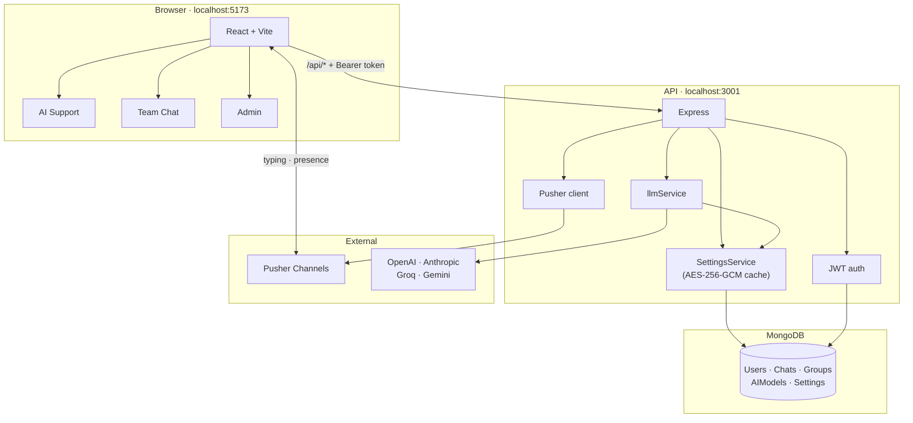

# MeshDesk

AI support and team chat in one workspace — same users, one login, two modes.

## About MeshDesk

MeshDesk merges two tools internal teams usually run separately: an **AI support assistant** for drafting answers and looking up policies, and a **team chat** for coordinating in real time. One product, one account, one sidebar — switch modes without switching apps.

**Who it's for:** Support, ops, and internal teams that need both async AI help and live group conversation (handoffs, escalations, quick syncs).

**AI Support** — Threaded conversations with pluggable LLM providers (OpenAI, Anthropic, Groq, Gemini). Pick a model per thread, keep context across messages, and fall back to a workspace default if a provider fails.

**Team Chat** — Group channels with typing indicators, online presence, and Pusher-backed live updates. Create groups, invite workspace users, coordinate without leaving MeshDesk.

**Admin** — Manage users (roles, suspend, bulk actions), store integration secrets encrypted in MongoDB, and add or deactivate AI models without redeploying. Only `DATABASE_URL` and `ENCRYPTION_KEY` stay in `.env`.



| Capability | Summary |
|------------|---------|
| Auth | JWT signup/login; first user or reset script → admin |
| Secrets | AES-256-GCM in MongoDB; masked in admin UI |
| Validation | Shared Zod schemas (`meshdesk-shared`) on client and server |
| Errors | Stable `{ error: { code, message, fields? } }` + client toasts |
| Observability | Pino logs with `X-Request-Id` correlation |
| Production | Rate limits, health checks, server test suite |



## Stack

| Layer | Tech |
|-------|------|
| Client | React, Vite, Tailwind |
| API | Node, Express, Mongoose, Zod, Pino |
| Shared | `meshdesk-shared` schemas |
| Secrets | MongoDB-encrypted settings (not `.env`) |
| Realtime | Pusher Channels |

```
MeshDesk/
├── client/    React app
├── server/    Express API
├── shared/    Zod schemas
└── api/       Vercel entry
```

## Quick start

**Requires:** Node 18+, MongoDB URI, 32-byte encryption key.

```bash
copy .env.example .env          # set DATABASE_URL + ENCRYPTION_KEY
node -e "console.log(require('crypto').randomBytes(32).toString('hex'))"
npm install
npm run dev                     # web :5173 · api :3001
```

Fresh database with a default admin:

```bash
npm run reset:db:yes
```

| | Default |
|---|---------|
| URL | http://localhost:5173 |
| Email | `admin@meshdesk.local` |
| Password | `Admin123!mesh` |

Then **Admin → Integrations** to add JWT (if needed), LLM keys, Pusher, and AI models.

> Use **5173** only — auth is per-origin. `/api/*` in the browser returns “authentication required” without a JWT; use the app after login.

**Upgrading?** Run `npm run migrate:settings` once to move legacy `.env` keys (`OPENAI_*`, `JWT_SECRET`, `PUSHER_*`) into the database.

## Environment

| Variable | Required | Notes |
|----------|----------|-------|
| `DATABASE_URL` | Yes | MongoDB URI |
| `ENCRYPTION_KEY` | Yes | Settings encryption key |
| `VITE_API_URL` | No | Client only; omit when proxied |

Everything else (API keys, JWT, Pusher) lives in **Admin → Integrations**.

## Scripts

| Command | Purpose |
|---------|---------|
| `npm run dev` | API + client |
| `npm run reset:db:yes` | Wipe DB + create admin |
| `npm run migrate:settings` | Import legacy `.env` secrets |
| `npm run seed:ai-models` | Default OpenAI model row |
| `npm test` | Server tests |
| `npm run build` | Production client build |

## Admin

- First signup on an empty DB → admin.
- Or `npm run reset:db:yes` (see defaults above).
- Promote a user: `{ $set: { role: "admin", isAdmin: true } }` on `users`, then re-login.

## Health

| Endpoint | Purpose |
|----------|---------|
| `GET /health` | Liveness |
| `GET /health/ready` | DB + Pusher + LLM status |

## Design

Mode-aware UI: periwinkle accent for **AI Support**, teal for **Team Chat**, neutral for **Admin**. Tokens live in `client/src/styles/tokens.css`.
